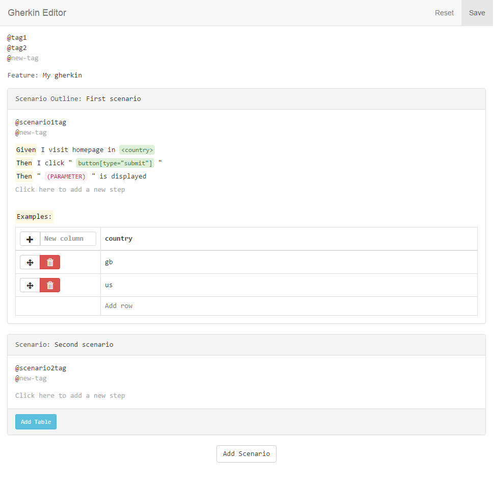

# nightwatch-cucumber-editor

[](https://badge.fury.io/js/nightwatch-cucumber-editor)
[](https://travis-ci.org/aberonni/nightwatch-cucumber-editor)

## Installation

### Step 1

This module is made for projects based on [nightwatch-cucumber](https://github.com/mucsi96/nightwatch-cucumber) so first of all you will need a nightwatch-cucumber based project up and running.

### Step 2

Install this module globally

```bash
npm install -g nightwatch-cucumber-editor
```

### Step 3 (optional)

In your project root, add a json configuration file named `.gherkineditor.json`.
If you do not add this file, or if you don't provide all variables, the defaults will be used. 

## Configuration

These are the default configuration options that can be overwritten in your `.gherkineditor.json` file.

```json
{
    "stepsFolder": "features/step_definitions",
    "componentsFile": "scripts/libs/components.js"
}
```

### stepsFolder

This should be the folder where your step definitions are stored. The default value is the same default that is used in nightwatch-cucumber.

### componentsFile

Optionally you can add a list of components as a suggestion when step definitions are parameterized. 
In order to do so you need to provide an object that exports a `_components` property that this module will read.

```js
// scripts/libs/components.js

module.exports{
    _components: [
        'component1',
        'component2',
        'component3',
        'component4'
    ]
}
```

## Usage

Once you have finished the setup and configuration you can `cd` into your project folder and launch:

```bash
nightwatch-cucumber-editor
```

This will open a web page containing a simple user interface allowing you to create new .feature files.

 

## Help needed!

If you have any improvements to make or if you have encountered any issues, please contribute or get in touch!

### Local development
This project is setup to work with VS Code. 
For debugging, add the following into your settings.json in VS Code so that it can work properly.

```json
"gherkin.editor.debug.cwd": "C:\\Path\\To\\Nightwatch\\Project\\Folder"
```
